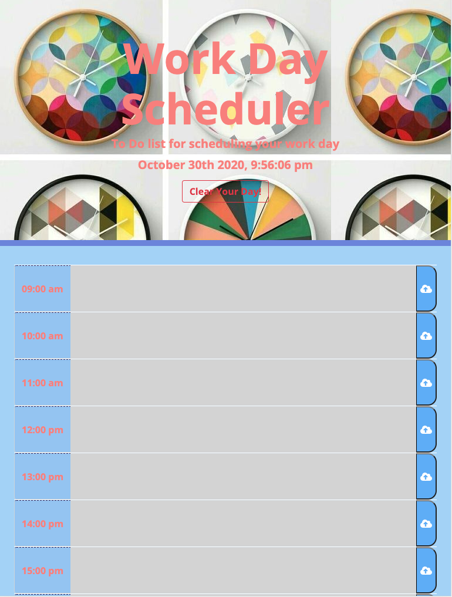

# WorkDayScheduler
Third-Party APIs: Work Day Scheduler
Is a simple calendar application that allows a user to save events for each hour of the day by modifying starter code. This app will run in the browser and feature dynamically updated HTML and CSS powered by jQuery.


# homeworkunit5

# Work Day Scheduler WEBPAGE

```
This App will help you as an employee with a busy schedule, to add important events to a daily planner, so that can manage your time effectively
```

## How to create a Work Day Scheduler?

Using the Bootstrap CSS Framework to develop an app powered with JQUERY, using the [Moment.js](https://momentjs.com/) library to work with date and time.

## How does it works?
```
WHEN I open the planner
THEN the current day is displayed at the top of the calendar
WHEN I scroll down
THEN I am presented with time blocks for standard business hours
WHEN I view the time blocks for that day
THEN each time block is color-coded to indicate whether it is in the past, present, or future
WHEN I click into a time block
THEN I can enter an event
WHEN I click the save button for that time block
THEN the text for that event is saved in local storage
WHEN I refresh the page
THEN the saved events persist
```

## Mock-Up

The following picture shows how the application looks:




## Credits 

To solve the needs to this subject, I use the following pages 
- https://www.w3schools.com/
- https://getbootstrap.com/
- https://momentjs.com/
- https://stackoverflow.com/


## Challenge

It was difficult; at first it was kind of easy, to customize and set the html page, because it had an started files, but synchronize the time with momentjs, using JQuery was when it increased the difficulty, and make it save in local storage, my code works, but I´m sure it is possible to reduce the size of my code with a for function, but I couldn´t manage to do so; but at least this time my code works.


## Contributing

- https://github.com/AlheliMi/WorkDayScheduler.git
- https://alhelimi.github.io/WorkDayScheduler/
